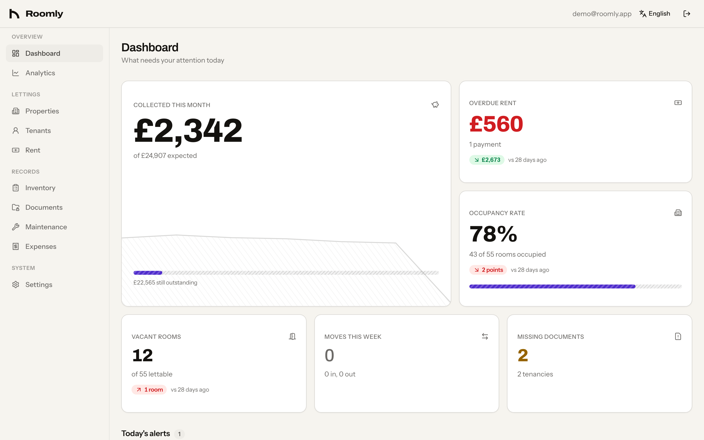
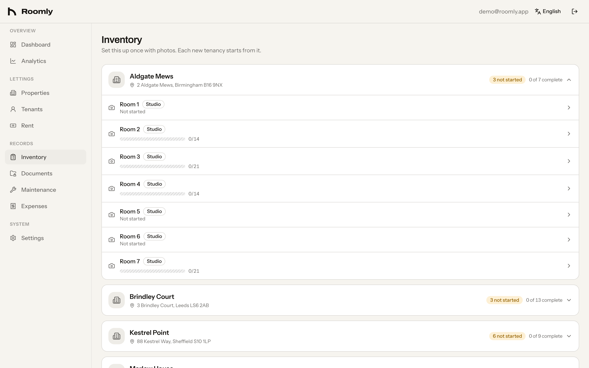
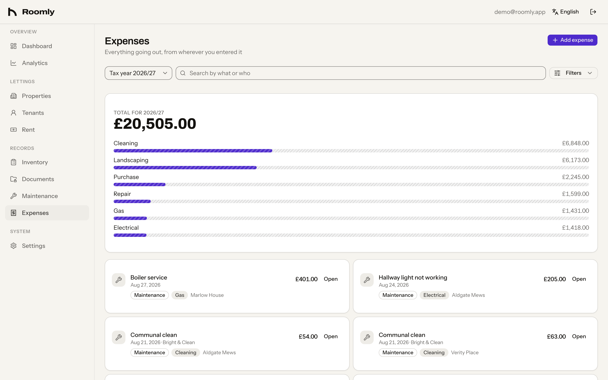
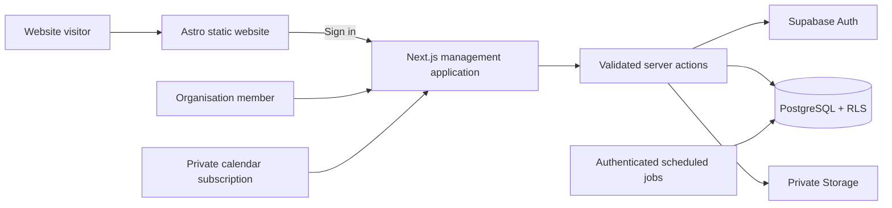

<p align="center">
  
</p>

<p align="center">
  <a href="https://roomly-site.vercel.app">Website</a> ·
  <a href="https://roomly-kappa.vercel.app/en/login">Application</a> ·
  <a href="SETUP.md">Quick start</a> ·
  <a href="docs/architecture.md">Architecture</a> ·
  <a href="docs/INTEGRATION_PROGRESS.md">Roadmap</a>
</p>

<p align="center">
  
  
  
  
</p>

Roomly brings the work of looking after a property into one place: the room, the people living in it, what is due, what needs fixing and what was recorded at handover. Built for small UK letting teams managing shared houses, HMOs, studios, flats and short stays.

It is a responsive web application with private organisation workspaces, three interface languages and an installable phone experience. The marketing website lives in [`site/`](site), with its own static build and deployment.



## Why Roomly

A spreadsheet can hold the rent. A folder can hold the inventory. Neither tells the next person why a room is empty, where its check-in photos are or whether a repair has already been counted as an expense.

Roomly keeps those connections explicit. Properties contain rooms; tenancies connect people to rooms; documents, payments and condition reports stay attached to the records they describe.

## What you can do

| Area                     | Included in the management application                                                                                     |
| :----------------------- | :------------------------------------------------------------------------------------------------------------------------- |
| **Properties & rooms**   | Buildings, room types, studios and flats, shared areas, property photographs and room baselines.                           |
| **People & tenancies**   | Separate tenant records and shared occupancies; upcoming, active, ended and archived tenancies; long lets and short stays. |
| **Rent**                 | Weekly, fortnightly, four-weekly, monthly and total-price schedules, recorded payments and overdue balances.               |
| **Inventory**            | Structured condition and cleanliness ratings, notes and dated photos; check-in/check-out comparison and PDF exports.       |
| **Documents**            | Private tenancy and property records, document types, expiry dates, missing-document checks and a document library.        |
| **Maintenance**          | Scheduled and recurring jobs, contractor contacts, assets, warranties, invoices and completion costs.                      |
| **Expenses**             | Manual expenses, maintenance, assets and utility costs in one ledger; UK tax-year totals and bills-included comparisons.   |
| **Overview & analytics** | Occupancy, rent and cost summaries, room availability, move dates and alerts.                                              |
| **Communication**        | Private calendar subscriptions, optional email digests, WhatsApp deep links and copyable WeChat messages.                  |
| **Team & preferences**   | Owner, admin, staff and viewer roles; English, Simplified Chinese and Turkish; light, dark and system themes.              |
| **Record lifecycle**     | Retention settings, previews, legal holds and scheduled cleanup, including export-before-photo-purge controls.             |

<details>
<summary><strong>Take a closer look: inventory and expenses</strong></summary>

### The condition of a room, recorded



### The costs of a property, connected



</details>

## A few decisions worth looking at

- **The tenancy is not the person.** Two occupants can share one rent and deposit while keeping separate contact and identity records. A tenant can return without becoming a duplicate person.
- **Month-end rent stays anchored.** A tenancy starting on the 31st clamps to February’s last day and returns to the 31st in March. It does not drift earlier each month.
- **Costs have one source.** The expense ledger is a database view over expenses, completed maintenance, assets and utilities. A repair cost is not copied into a second accounting record.
- **Authorisation reaches the database.** Organisation membership and roles are checked by server actions and PostgreSQL row-level security. Private files use scoped paths and expiring links.
- **Reminders use familiar tools.** Calendar subscriptions work with a user’s calendar; message buttons open or prepare the user’s own messaging app. They do not silently send messages.
- **Retention is a workflow.** Preview, legal hold, export and deletion rules are represented in the application rather than left to an occasional manual cleanup.

## Run locally

Use **Node.js 24** and npm. The application requires an isolated Supabase project; the website and automated unit/database tests can run without cloud credentials.

```bash
git clone https://github.com/joshuakhalili/roomly.git
cd roomly
npm ci
cp .env.example .env.local
```

Fill in the Supabase configuration, apply **all** migrations in filename order and provision an organisation with an owner. See the [setup guide](SETUP.md) for the exact sequence. Creating an Auth user alone does not grant access to an organisation.

```bash
npm run dev
# http://localhost:3000/en/login
```

To work on the website independently:

```bash
cd site
npm ci
npm run dev
# http://localhost:4321
```

<details>
<summary><strong>Environment variables</strong></summary>

| Variable                                                 | Purpose                                                                      |
| :------------------------------------------------------- | :--------------------------------------------------------------------------- |
| `NEXT_PUBLIC_SUPABASE_URL`                               | Supabase project URL.                                                        |
| `NEXT_PUBLIC_SUPABASE_ANON_KEY`                          | Public client key; requests still require authorisation and RLS.             |
| `SUPABASE_SERVICE_ROLE_KEY`                              | Server-only administration and background jobs. Never expose it to a client. |
| `CRON_SECRET`                                            | Authenticates scheduled jobs; configure only in the intended environment.    |
| `NEXT_PUBLIC_APP_URL`                                    | Canonical app URL used in calendar links and other absolute URLs.            |
| `NEXT_PUBLIC_TURNSTILE_SITE_KEY`, `TURNSTILE_SECRET_KEY` | Optional sign-in challenge; configure both together.                         |
| `TURNSTILE_EXPECTED_HOSTNAME`                            | Optional challenge hostname check.                                           |
| `LOGIN_RATE_LIMIT_SECRET`                                | Optional dedicated HMAC secret for login throttling.                         |
| `RESEND_API_KEY`, `RESEND_FROM_EMAIL`                    | Optional email digest delivery.                                              |

The current management app does not require an OpenAI key. The resident AI integration is tracked separately below. The static website needs no secrets.

</details>

## How it fits together



```text
src/
  app/[locale]/       Management routes, auth and shared layouts
  app/api/            Calendar feeds and scheduled jobs
  components/         Feature UI and shared controls
  lib/                Actions, queries, scheduling and retention logic
  i18n/               Routing for en, zh and tr
  messages/           Translated interface copy
supabase/migrations/  Ordered database history — 26 existing migrations
site/                 Marketing website, editorial content and image credits
tests/integration/    Embedded PostgreSQL migration checks
scripts/              Organisation provisioning and tenancy verification
docs/                 Architecture, feature ledger and integration progress
```

More detail: [architecture](docs/architecture.md) · [security](SECURITY.md) · [feature ledger](docs/FEATURE_LEDGER.md) · [website provenance](site/README.md).

## Verification

```bash
npm run lint
npm run typecheck
npm test
npm run test:database
npm run build
npm --prefix site run check
npm --prefix site run build
npm run test:site
```

The baseline at the start of integration passed **41 operational tests**. The new embedded PostgreSQL check applies all **26 historical migrations unchanged** and verifies RLS remains enabled on every public table. These are specific checks, not a claim that every feature or hosted integration has been verified.

The website passes **4 browser tests**, including all **13 routes at three widths**, keyboard controls and reduced motion, with no serious or critical axe findings.

The [verification record](docs/VERIFICATION.md) distinguishes local checks from pending browser, hosted Auth/Storage and release checks. CI runs installs, lint, types, tests and builds. Generated reports and environment files stay out of Git.

## Project status & review access

Roomly is a **portfolio project under active development**. Product screenshots use fictional review data; photography is licensed stock imagery, not customer testimony. No accreditation, customer count, uptime guarantee or independent security audit is claimed. Project and demo context is documented here rather than added to product screens.

The existing management application is the canonical foundation. The new manager onboarding and resident Home experience has been developed in a separate local implementation and is **not yet integrated into this branch’s management application**. Its test results must not be presented as evidence for the integrated release.

The approved integration preserves rent, inventory, expenses, documents, maintenance and every existing operational feature. Its next stages are:

- [x] Preserve upstream history and original checkouts.
- [x] Add a regression and migration-test foundation.
- [x] Bring website source, product imagery and documentation into the canonical repository.
- [ ] Integrate manager onboarding and resident identity with the existing data model.
- [ ] Add invitation-based resident Home, reviewed content, source-backed answers and repair intake.
- [ ] Apply the shared UI throughout the existing management routes.
- [ ] Complete cross-role regression, upgrade rehearsal and hosted-service verification.
- [ ] Release the integrated app and refreshed website after the release gates pass.

For a hosted review account, [request access](mailto:joshuakhalili20@gmail.com?subject=Roomly%20review%20access). Credentials are not published in this repository. To create your own isolated workspace, follow [SETUP.md](SETUP.md). A credential-free adapter for the **integrated** app is still pending; the website and database tests already run independently.

Follow the [full integration plan](docs/ROOMLY_GITHUB_INTEGRATION_PLAN.md) and [live checklist](docs/INTEGRATION_PROGRESS.md) for the remaining work.

## Contributing

Read [CONTRIBUTING.md](CONTRIBUTING.md). Keep changes focused, preserve existing routes and data, include verification and document migration effects. Report security issues privately using [SECURITY.md](SECURITY.md).

Built by [Joshua Khalili](https://github.com/joshuakhalili). No open-source licence has been added to this repository; public source visibility alone does not grant permission to reuse it. Website photographs retain their [Pexels licence](https://www.pexels.com/license/) and are credited in [site/README.md](site/README.md).
