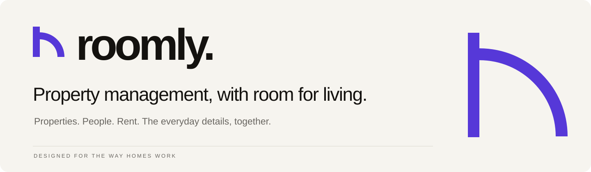
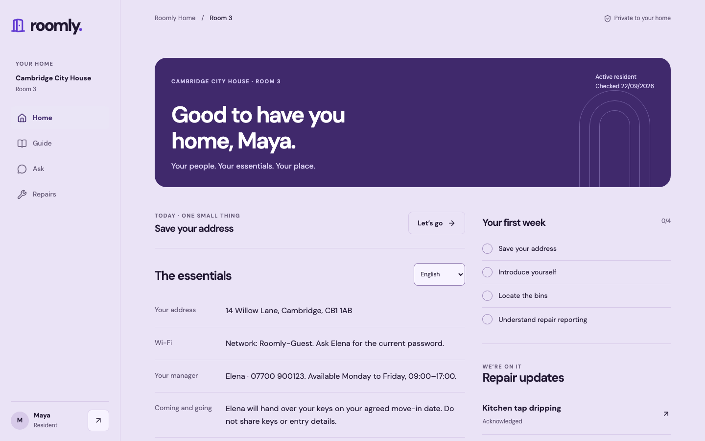

<p align="center"></p>

<p align="center"><a href="docs/FEATURES_AND_REMAINING_WORK.md">Features</a> · <a href="#run-the-demo">Run locally</a> · <a href="docs/architecture.md">Architecture</a> · <a href="docs/ACCEPTANCE.md">Verification</a></p>

A resident handbook and manager workspace for UK shared, co-living and student homes. The release specification is [ASTRA_IMPLEMENTATION_HANDOVER.md](ASTRA_IMPLEMENTATION_HANDOVER.md).



## Project context

This directory preserves the resident and onboarding application alongside the management application in the repository root. It is a portfolio project; local identities and seeded data are fictional. That context belongs in this README and engineering docs, not product banners.

The applications have separate authentication, deployments and schemas. **Never apply this directory’s migrations to the management database.** There is no automatic data sync or resident access to the management workspace. The resident production release requires its own Supabase project and acceptance checks; the local adapter is fully usable without credentials.

## Included here

| Resident | Manager |
| --- | --- |
| Private invitation and resumable onboarding | Resumable seven-step setup |
| Permanent Home and permission-filtered guide | Structured content, autosave and version history |
| Reviewed English, Chinese and Turkish content | Draft/publish separation and resident preview |
| Cited answers, refusal and emergency guidance | AI extraction and translation with human review |
| Agreements and first-week checklist | Invitations, question inbox and readiness checks |
| Repair intake, attachments and status timeline | Repair updates and property settings |

## Run the demo

Use Node.js 24 (Node 22.13+ is also required for the SQLite adapter) and pnpm 11.

```sh
pnpm install
DEMO_MODE=true pnpm dev
```

Open [Roomly](http://127.0.0.1:3000). Demo mode is the local default when `DEMO_MODE` is unset; no `.env` or cloud account is needed. The server binds to loopback.

At **Sign in**, choose:

- **Maya** — resident with a permanent Home, reviewed English/Chinese/Turkish guide and an active repair.
- **Elena** — manager with a published property, pending AI suggestions, content editor, invites and repair inbox.
- **New manager** — complete the seven-step setup; leave and return to resume.
- **New resident** — claim an invitation created by Elena, then complete resident onboarding.

Demo identities require no passwords. Create an invitation under Elena → Invites, copy the link, and open it while signed in as New resident. The invitation is one-use and expires. To evaluate more homes, a resident can claim invites to different rooms.

Demo state, session hashes and private attachments are stored in `.roomly/demo.sqlite`, excluded from Git. Changes survive refreshes and process restarts. To start a separate fresh demo without deleting anything:

```sh
ROOMLY_DEMO_DB=.roomly/fresh-review.sqlite DEMO_MODE=true pnpm dev
```

`provider-error` in an Ask question or extraction notes exercises the provider-unavailable state. Ask about bins for a cited answer, a swimming pool for a refusal, or a gas smell for deterministic emergency guidance. No email, SMS, WhatsApp, vendor dispatch or payment is sent.

See the [complete feature inventory and remaining production work](docs/FEATURES_AND_REMAINING_WORK.md).

## Verify

```sh
pnpm lint
pnpm typecheck
pnpm test
pnpm exec playwright install chromium
pnpm test:e2e
pnpm build
```

The default tests require no provider credentials or Docker. Vitest applies the actual migrations to embedded PostgreSQL (PGlite), including `pgcrypto`, then exercises RLS under authenticated roles. The browser suite uses a separate port (3100), build folder, and fresh SQLite file per run. Test artifacts are ignored except selected product screenshots in `docs/screenshots`.

## Production configuration

Copy `.env.example` to `.env.local`, set `DEMO_MODE=false`, and provide:

| Variable | Purpose |
| --- | --- |
| `NEXT_PUBLIC_SUPABASE_URL` | Supabase project URL |
| `NEXT_PUBLIC_SUPABASE_ANON_KEY` | Public anon/publishable client key |
| `OPENAI_API_KEY` | Server-only provider key |
| `OPENAI_MODEL` | Optional model override; default `gpt-4.1-mini` |
| `NEXT_PUBLIC_SITE_URL` | Canonical HTTPS application URL and auth callback base |

No Supabase service-role key is used. Production database operations use the authenticated user's JWT and RLS. Startup/build validation fails if required production configuration is missing. Public Vercel deployment is refused with demo mode enabled.

Apply `supabase/migrations` in order to a new Supabase project. Configure Auth redirect URLs for `/auth/callback`, email verification and your SMTP service. Never load the local seed into a customer project. The private `maintenance` storage bucket and policies are created by migration.

Before using cloud resources, read the [resource audit](docs/PRODUCTION_RESOURCE_AUDIT.md): the existing Roomly operations database uses the canonical schema and must be extended additively. Do not apply this standalone schema over it.

With Docker and Supabase CLI installed:

```sh
pnpm db:start
pnpm db:reset
pnpm db:test
pnpm db:types
```

Type generation replaces the checked-in types only after the CLI succeeds; failures preserve the current file.

See [architecture](docs/architecture.md), [data security](docs/data-security.md), [AI safety](docs/ai-safety.md), [testing](docs/testing.md), [deployment](docs/deployment.md), and the [acceptance matrix](docs/ACCEPTANCE.md).

The original static prototype is preserved at `docs/prototypes/roomly-pass.html`. It is not served by Next.js and is not a source of production private information.
